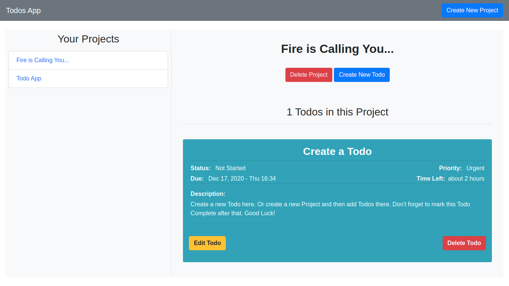

# Todos App
This is a dynamically generated Todos App using JS and Webpack. It allows the user to create and delete projects and todos. Todos can be edited afterwards. Each project shows the todos contained in it and individual todos are listed with their title, due date, time left before deadline, priority and description. Forms are presented in Bootstrap modals.

Undeleted projects and todos are persisted using the browser's localStorage, when you open the app in the same browser, all your projects and todos remain available indefinitely.

## Built with
- Vanilla JavaScript/ES6
- Webpack
- date-fns
- HTML
- Bootstrap

## Live version
Available [here](https://rawcdn.githack.com/anewman15/to-dos-app/efd8055b4d486517555464870644e9dd75537dc9/dist/index.html)

## Deployment
1. Open your Terminal from a folder of your choice and clone [this repo](https://github.com/anewman15/to-dos-app/)
2. Navigate to the project directory
3. Run `npm install`
4. Then run `npm run start`
5. Open `http://localhost:8080/dist/index.html` in your browser and navigate around the site.
6. Create Projects and Todos, edit them and delete them

## Testing
1. Run `npm run test` or `npm run test unit` in the Terminal to run the tests

## Author

👤 **Abdullah Numan**

- Github:   https://github.com/anewman15
- Twitter:  https://twitter.com/aanuman15
- Linkedin: https://www.linkedin.com/in/aanuman15/
- Email:    anewman15@hotmail.com

##    Contributing

Contributions, issues and feature requests are welcome!
Please send your feedback [here](https://github.com/anewman15/to-dos-app/issues)

## Show your support

Give a ⭐️ if you like this project!